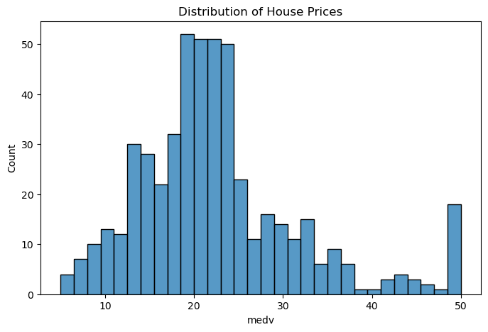
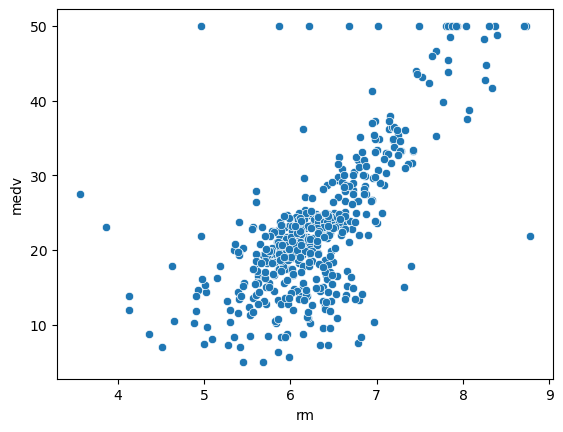
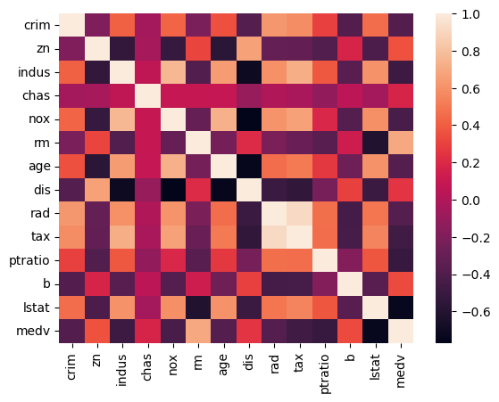

# House Pricing Data Analysis

A data analysis and machine learning project exploring the Boston Housing dataset, with exploratory visualizations and a simple linear regression model to predict median house prices.

## Overview

This project walks through a complete (if lightweight) data science workflow:

1. Loading and cleaning the Boston Housing dataset
2. Exploratory data analysis (EDA) with summary statistics and visualizations
3. Examining relationships between features and house prices
4. Training a linear regression model to predict median home value (`medv`)
5. Evaluating model performance

## Dataset

The project uses the classic **Boston Housing dataset** (`BostonHousing.csv`), which contains **506 records** across **14 columns**, including:

| Column | Description |
|---|---|
| `crim` | Per-capita crime rate by town |
| `zn` | Proportion of residential land zoned for large lots |
| `indus` | Proportion of non-retail business acres per town |
| `chas` | Charles River dummy variable (1 if tract bounds river) |
| `nox` | Nitric oxide concentration |
| `rm` | Average number of rooms per dwelling |
| `age` | Proportion of owner-occupied units built before 1940 |
| `dis` | Weighted distance to employment centers |
| `rad` | Index of accessibility to radial highways |
| `tax` | Property tax rate |
| `ptratio` | Pupil-teacher ratio by town |
| `b` | Proportion of Black residents by town |
| `lstat` | % lower status of the population |
| `medv` | Median value of owner-occupied homes (target variable, in $1000s) |

No missing values were found in the dataset during cleaning.

## Exploratory Data Analysis

### Distribution of House Prices

A histogram of `medv` shows the spread of median home values across the dataset, revealing a roughly bell-shaped distribution with a cluster of higher-priced homes near $50k.



### Rooms vs. Price

A scatter plot of average rooms per dwelling (`rm`) against `medv` shows a clear positive relationship — homes with more rooms tend to have higher median values.



### Feature Correlation Heatmap

A correlation heatmap across all numeric features highlights which variables are most strongly related to house price, as well as relationships between predictors themselves (useful for spotting multicollinearity).



## Modeling

A simple **Linear Regression** model was trained using `rm` (average number of rooms) as the sole predictor of `medv`.

- **Train/test split:** 80% train (404 samples) / 20% test (102 samples)
- **Model:** `sklearn.linear_model.LinearRegression`
- **Evaluation metric:** R² score

### Results

| Metric | Value |
|---|---|
| R² Score | **0.27** |

An R² of ~0.27 indicates that the number of rooms alone explains roughly 27% of the variance in house prices — a reasonable starting point, but a sign that additional features (e.g. `lstat`, `ptratio`, `nox`) would likely improve predictive performance.

## Conclusions

1. Houses with more rooms generally have higher prices.
2. Data visualization was valuable for understanding relationships within the dataset.
3. A basic linear regression model can predict house prices from room count alone, though with limited accuracy.

## Possible Next Steps

- Incorporate additional features (e.g. `lstat`, `ptratio`, `nox`) into a multiple linear regression model
- Try non-linear models (Random Forest, Gradient Boosting) for improved accuracy
- Perform feature scaling and regularization (Ridge/Lasso) to handle multicollinearity
- Add cross-validation for more robust performance estimates

## Project Structure

```
.
├── House_Pricing_Data_Analysis.ipynb   # Main analysis notebook
├── BostonHousing.csv                    # Dataset
├── images/                              # Exported plots referenced in this README
│   ├── price_distribution.png
│   ├── rooms_vs_price.png
│   └── correlation_heatmap.png
└── README.md
```

## Requirements

- Python 3.x
- pandas
- numpy
- matplotlib
- seaborn
- scikit-learn

Install dependencies with:

```bash
pip install pandas numpy matplotlib seaborn scikit-learn
```

## Usage

1. Clone or download this repository
2. Ensure `BostonHousing.csv` is in the project directory
3. Open `House_Pricing_Data_Analysis.ipynb` in Jupyter Notebook or JupyterLab
4. Run all cells to reproduce the analysis
